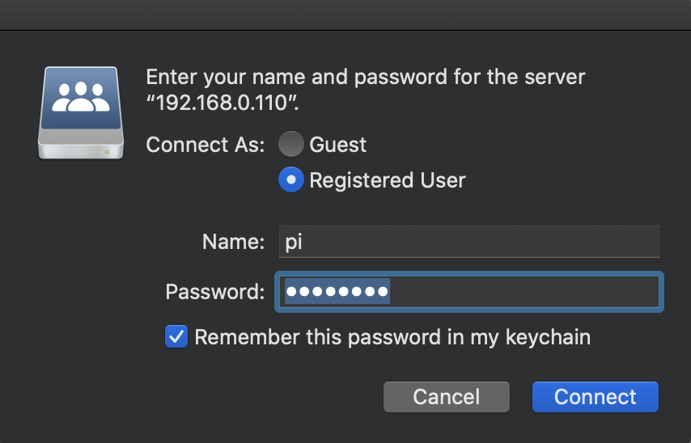

# Running samba on Raspberry Pi 3

### Use case
- Say you have a couple of USB storage devices and you plan to share them accross your devices at home.
- You want to quickly take a backup of your data from your pc/mobile/laptop without any leg-work.
- In some situations, you may be forced to use this model. For example, you may have slow USB interface or may not have a adapter to connect a storage device.

### Ready your device
- [Install official Raspbian image](https://www.raspberrypi.org/documentation/installation/installing-images/)
- [Enable SSH login](https://www.raspberrypi.org/documentation/remote-access/ssh/README.md#3-enable-ssh-on-a-headless-raspberry-pi-add-file-to-sd-card-on-another-machine) (optional)
- [Configure vncserver](https://www.raspberrypi.org/documentation/remote-access/vnc/) (optional)

### Install and configure Samba on your Pi


#### Step 1 : Configure a static ip for your Pi
I have configired my wifi router to assign a fixed ip to my Pi.
This can be done by adding a mac to ip binding in the DHCP config.
I was able to do it for my router from the dhcp tab as shown below.


#### Step 2 : Configure a user with proper permission and access
I have used the user pi with a strong password. Use the below command to set a password for your Pi
```
sudo passwd pi
```

#### Step 3: Ensure you have tools to mount your external device
For my case, i had to install the following package to support my NTFS formatted device.
```
sudo apt-get install ntfs-3g
```

#### Step 4: Install Samba 
```
sudo apt-get update
sudo apt-get upgrade
sudo apt-get install samba samba-common-bin
```

#### Step 5: Configure Samba
You need to edit "/etc/samba/smb.conf" file to define what and with whom you need to share.
For me the user is "pi" and I am sharing my external storage mounted on /media/pi.

```
[Media]
comment = shibir-rpi
public = no
writeable = yes
browseable = yes
path = /media/pi/SHIBIR_Storage
create mask = 0777
directory mask = 0777
```

Note: You can set public=yes, if you want anyone to access your files (not recomended).
I have only provided permission to user "pi".

```
sudo smbpasswd -a pi
sudo systemctl restart smbd
```

#### Step 6: Test from a client
From any device on the local network, now you can access the files.
Try smb://192.168.0.110 from a browser.

