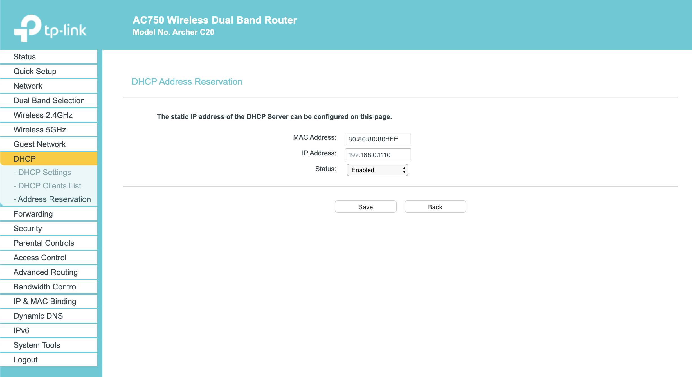
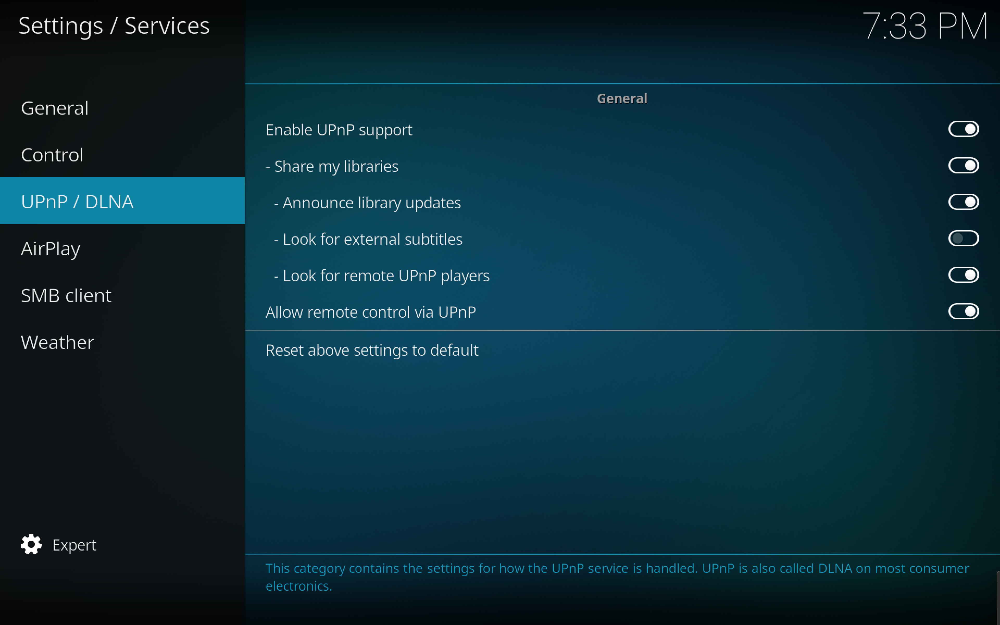

# Media center for your home using Kodi

### Use case
- A centralized media centre which you can access from all your devices (TV/smart phone/PC)

### Ready your device
- [Install official Raspbian image](https://www.raspberrypi.org/documentation/installation/installing-images/)
- [Enable SSH login](https://www.raspberrypi.org/documentation/remote-access/ssh/README.md#3-enable-ssh-on-a-headless-raspberry-pi-add-file-to-sd-card-on-another-machine) (optional)
- [Configure vncserver](https://www.raspberrypi.org/documentation/remote-access/vnc/) (optional)

### Install and configure kodi as media center

#### Step 1 : Configure a static ip for your Pi
I have configired my wifi router to assign a fixed ip to my Pi.
This can be done by adding a mac to ip binding in the DHCP config.
I was able to do it for my router from the dhcp tab as shown below.



#### Step 2 : Install Kodi on Pi
```
sudo apt-get update
sudo apt-get install kodi
```
#### Step 3: Enable uPnP protocol to share your libraries

You can add specific directories to Movies, Music, etc.

#### Step 4: Make sure to run Kodi at init
```
pi@rpi:~ $ cat /etc/xdg/lxsession/LXDE-pi/autostart
@lxpanel --profile LXDE-pi
@pcmanfm --desktop --profile LXDE-pi
@xscreensaver -no-splash
@kodi
@deluged
@deluge-web
```

#### Step 5: Access Kodi as client
- Install kodi on your TV/mobile device.
- Enable uPnP as mentioned in step 3.
- Add the kodi(rpi) library by browsing.
