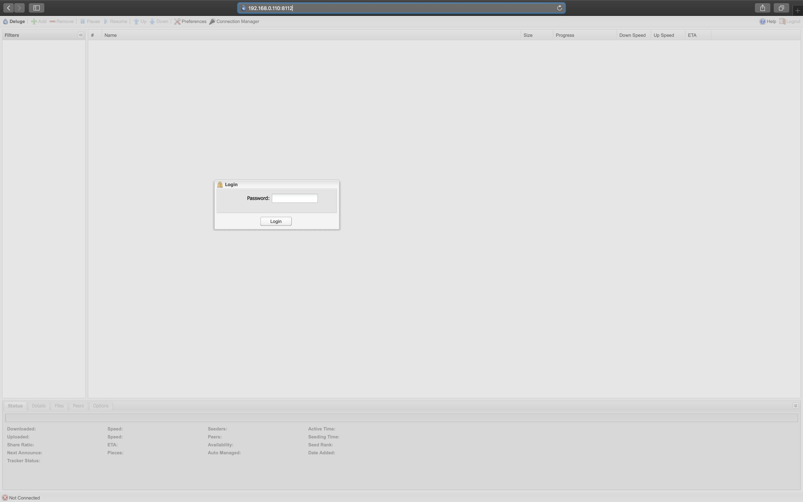

# Running deluge (torrent server) on Raspberry Pi 3

### Use case
- After adding a torrent file (legal) on your PC, you may want to control/monitor it from a smart phone/TV. Pi can run headless.
- You can manage torrent downloads from multiple devices without even loging into the Pi. We will use the web UI.
- You can initiate a download from your PC and turn it off from your smart phone.

### Ready your device
- [Install official Raspbian image](https://www.raspberrypi.org/documentation/installation/installing-images/)
- [Enable SSH login](https://www.raspberrypi.org/documentation/remote-access/ssh/README.md#3-enable-ssh-on-a-headless-raspberry-pi-add-file-to-sd-card-on-another-machine) (optional)
- [Configure vncserver](https://www.raspberrypi.org/documentation/remote-access/vnc/) (optional)

### Install and run deluged and deluge-web

#### Step 1 : Configure a static ip for your Pi
I have configired my wifi router to assign a fixed ip to my Pi.
This can be done by adding a mac to ip binding in the DHCP config.
I was able to do it for my router from the dhcp tab as shown below.


#### Step 2: Install deluge
```
sudo apt-get update
sudo apt-get upgrade
sudo apt-get install deluged 
sudo apt-get install deluge-console
sudo apt-get install python-mako 
sudo apt-get install deluge-web

```

#### Step 3: Configure deluge

Edit the file to add "user:password:level"
```
deluged sudo pkill deluged
echo "pi:mypassword:10" >> ~/.config/deluge/auth
```
Startup the daemon and console
```
deluged
deluge-console
```
Once inside the console apply the below config
```
config -s allow_remote True config allow_remote exit
```
restart deluged and deluge-web
```
deluged sudo pkill deluged
deluged
deluge-web
```

#### Step 4: Make sure to run deluged and deluge-web at init
```
pi@rpi:~ $ cat /etc/xdg/lxsession/LXDE-pi/autostart
@lxpanel --profile LXDE-pi
@pcmanfm --desktop --profile LXDE-pi
@xscreensaver -no-splash
@kodi
@deluged
@deluge-web
```

#### Step 5: Test the connection
You can log into the web UI using the following link.
```
http://192.168.0.110:8112
```


Default password is "deluge". You may be prompted to set a new password.
The default port is 8112. However, you can change it by:
```
sudo pkill deluge-web 
vim ~/.config/deluge/web.conf
```
